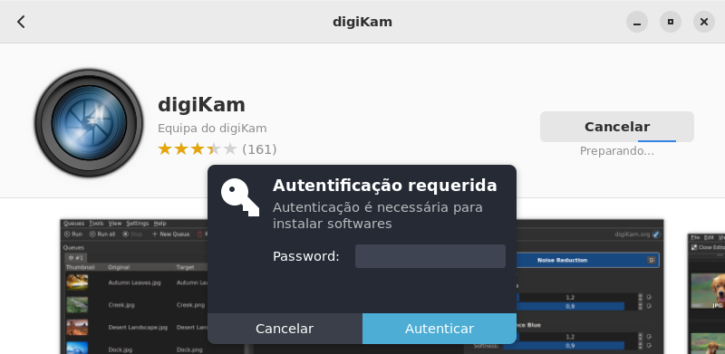
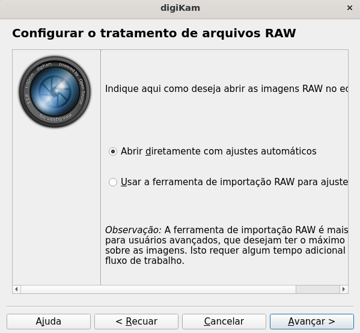

<h1 align ="center">Editor de Galeria digiKam</h1>


<p align ="justify"> O digiKam também é uma boa alternativa para a gestão de fotografias digitais no sistema operacional Linux, pois fornece um abrangente conjunto de ferramentas para importação, edição, gerenciamento, organização, visualização de fotografias e ficheiros RAW.</p>

<h2 align ="left">Instalação via linha de comando | 32bits e 64bits</h2>

<ul align ="justify">
    <li>Para fazer a instalação via linha de comando é necessário usar o terminal como root (administrador). Após entrar como "root", digite o comando abaixo para começar a instalação:</li>
</ul>

```sh
    apt install digikam
```
    
<div align="center">
    
</div>

<ul align ="justify">
    <li>Quando o comando for executado, o terminal começará a procurar os pacotes do programa, e para a instalação de fato ocorrer será necessário fazer a confirmação:</li>
</ul>
    
<div align="center">
    
</div>
    
<ul align ="justify">
    <li>Feita a confirmação, uma barrinha de progresso aparecerá na parte inferior do terminal:</li>
</ul>
    
<div align="center">
    
</div>
    
<ul align ="justify">
    <li>Quando a instalação terminar, se desejar você pode reiniciar a sua máquina com o seguinte comando:</li>
</ul>

```
    reboot
```

<div align="center">
    
</div>

<ul align ="justify">
    <li>É pronto, a sua instalação foi feita com sucesso!</li>
</ul>

<div align="center">
    
</div>
    
<br>

<h2 align ="left">Instalação usando Synaptic</h2>

<ul align ="justify">    
    <li>Para fazer a instalação pelo Synaptic você deve localizar o programa, então clique no menu e no ícone de lupa procure por "Synaptic":</li>
</ul>

<div align="center">
    
</div>
    
<ul align ="justify">
    <li>Será necessário fazer autenticação como root (administrador), portanto informe a senha:</li>
</ul>

<div align="center">
    
</div>
    
<ul align ="justify">    
    <li>Após abri-lo, localize novamente pelo ícone de lupa e procure por "digikam":</li>
</ul>

<div align="center">
    
</div>

<ul align ="justify">
    <li>Pela descrição confirme que irá instalar o aplicativo. Em seguida, clique nele com o botão direito do mouse e selecione a opção "Marcar para instalação":</li>
</ul>
    
<div align="center">
    
</div>

<ul align ="justify">
    <li>Após marcar a aplicação, clique em "Aplicar":</li>
</ul>

<div align="center">
    
</div>

<ul align ="justify">
    <li>Em seguida clique em "Apply":</li>
</ul>
 
<div align="center">
    
</div>

<ul align ="justify">
    <li>Então o processo será iniciado e uma barra de progresso será exibida na tela:</li>
</ul>

<div align="center">
    
</div>

<ul align ="justify">
    <li>Quando a instalação foi concluída, clique em "Close":</li>
</ul>

<div align="center">
    
</div>

<ul align ="justify">
    <li>É pronto, a instalação foi feita com sucesso!</li>
</ul>

<br>
    
<h2 align ="left">Instalação usando Gnome Software</h2>

<p align ="justify">Prefere uma instalação gráfica? Bem, não se preocupe que também é possível, confira a seguir:</p>
    
<ul align ="justify">
    <li>No menu, procure na lupa por "programas" e clique nele:</li>
</ul>
    
<div align="center">
    
</div>

<ul align ="justify">    
    <li>Assim que o programa abrir aparecerá a interface inicial. Novamente, localize a lupa e digite pelo nome do programa, isto é, "digiKam". Após a pesquisa ser concluída, o programa será exibido na tela:</li>
</ul>

<div align="center">
    
</div>

<ul align ="justify">
    <li>Então, para começar a instalação basta clicar nele e em "Instalar":</li>
</ul>
    
<div align="center">
    
</div>

<ul align ="justify">
    <li>Será necessário fazer autenticação como root (administrador) para prosseguir, dessa forma informe a senha:</li>
</ul>

<div align="center">
    
</div>

<ul align ="justify">
    <li>A instalação começará a acontecer e quando ela for concluída você já poderá executar o digiKam!</li>
</ul>
    
<div align="center">
    
</div>
    
<br>
    
<h2 align ="left">Utilização básica</h2>

<p align ="justify">Usar o programa é muito simples, observe o seguinte passo a passo:</p>

<ul align ="justify">
    <li>Para usá-lo precisamos localizar ele, então clique no menu e no ícone de lupa procure por "digiKam".</li>
</ul>
    
<div align="center">
    
</div>

<ul align ="justify">
    <li>Veja que só de escrever o seu nome já aparece de primeira, maravilha não? Então agora clique nele com o mouse e a tela de bem-vindo aparecerá, clique em "Avançar":</li>
</ul>
    
<div align="center">
    
</div>

<p align ="justify">Como será a  primeira vez em que o programa será executado, é preciso fazer algumas configurações antes de usá-lo.</p>

<ul align ="justify">
    <li>A primeira coisa a ser definida é o local onde serão armazenadas as imagens, por padrão o programa já reconhece uma pasta, mas se desejar você consegue alterá-la, feito isso clique em "Avançar":</li>
</ul>

<div align="center">
    
</div>

<p align ="justify">Se tratando de uma utilização básica, haverá algumas configurações em que optaremos por seguir as recomendações do aplicativo. </p>

<ul align ="justify">
    <li>A próxima configuração solicitada é a do banco de dados, logo, seguiremos o padrão do aplicativo, então clique em "Avançar":</li>
</ul>

<div align="center">
    
</div>

<ul align ="justify">
    <li>Na configuração de tratamento de arquivos RAW também seguiremos o padrão do aplicativo, portanto clique em "Avançar":</li>
</ul>

<div align="center">
    
</div>

<ul align ="justify">
    <li>No armazenamento de metadados nos arquivos, clique novamente em "Avançar":</li>
</ul>

<div align="center">
    
</div>

<ul align ="justify">
    <li>No comportamento de exibição, selecione "Carregar imagem" e clique em "Avançar":</li>
</ul>

<div align="center">
    
</div>

<ul align ="justify">
    <li>Na configuração de comportamento da abertura de arquivos, clique em "Avançar":</li>
</ul>

<div align="center">
    
</div>

<ul align ="justify">
    <li>A habilitação das dicas de contexto é algo mais pessoal, dependendo do seu interesse selecione a opção mais favorável e em seguida clique em "Avançar":</li>
</ul>

<div align="center">
    
</div>

<ul align ="justify">
    <li>É pronto, as configurações foram feitas, clique em "Terminar":</li>
</ul>

<div align="center">
    
</div>

<ul align ="justify">
    <li>A interface do programa será exibida e você já pode se divertir com o digiKam!</li>
</ul>

<div align="center">
    
</div>
