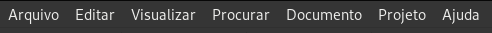
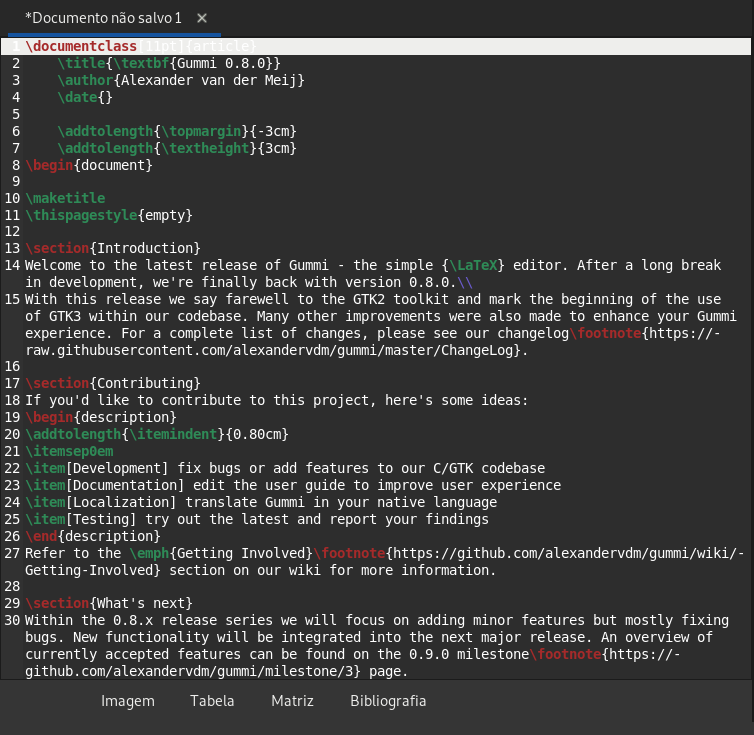
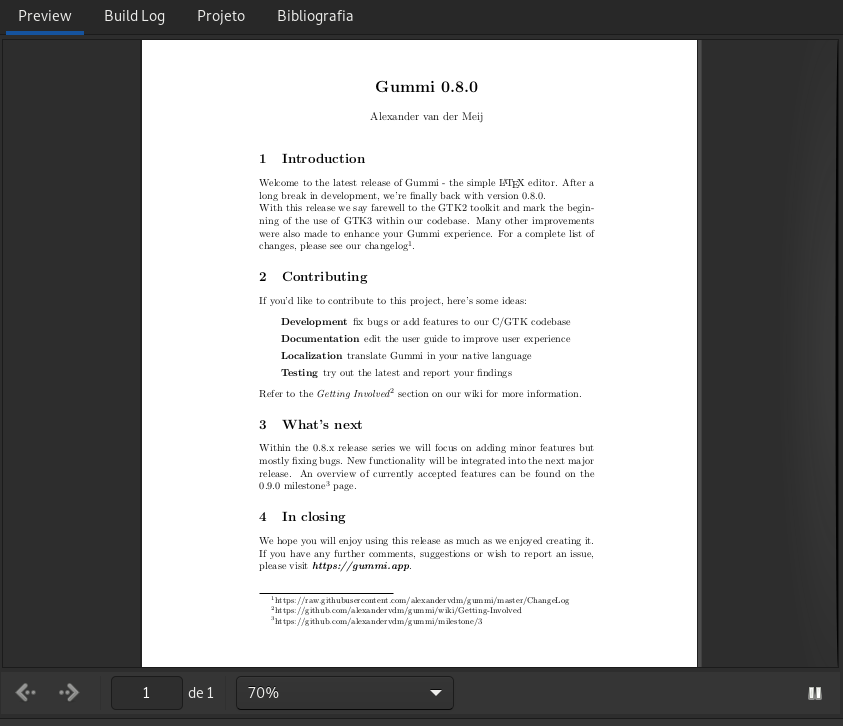
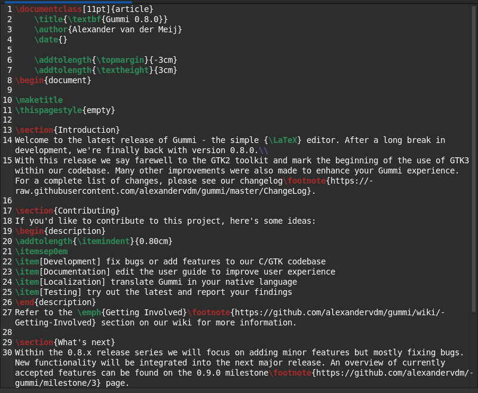
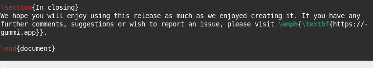
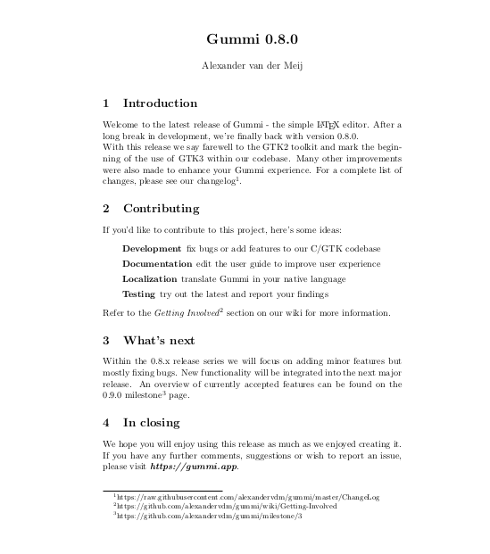

<h1 align=center> Editor de texto Gummi </h1>
<div align=center>
 
 

</div>

<p align=justify> 
O aplicativo Gummi é um editor de texto em Latex para o sistema Linux. Diferentemente dos editores de texto visuais o Gummi, através do Latex, permite criar documentos estruturados editados utilizando comandos, o que torna o processo mais eficiente e prático. Esse software tem diversas funcionalidades, as quais são voltadas para a montagem de documentos, como por exemplo permitir criar capas, adicionar índices, notas de rodapé, referências cruzadas, configurar indentações e muito mais: ele é muito útil para se realizar formatações limpas e bem organizadas em documentos textuais.
</p>


## Instalação via linha de comando | 32bits e 64bits

Para instalar é preciso usar um terminal como root (administrador) e executar o comando:
```sh
apt install gummi
```

## Utilização básica

<h3> 1. Funções principais e menus</h3>
<p align=justify>
 O aplicativo Gummi é um editor Latex para o sistema Linux. Esse software tem seis menus principais, sendo eles: arquivos – nesta opção podemos criar arquivos e salvá-los (inclusive como pdf), editar – essa opção traz ações que permitem editar o código-fonte do arquivo em Latex (ações como copiar, colar, selecionar, desfazer e refazer), visualizar – essa opção permite mudar a configuração de visualização dentro do software, procurar – opção em que podemos localizar e substituir palavras, documento – opção que permite compilar o documento que está sendo produzido e gerenciar as configurações de compilação, projeto – opção que nos permite criar projetos, e, ajuda – opção em que podemos escolher acessar informações do software e ver o guia de usuário.
</p>
<div align=center>
 
 

</div>

<p align=justify>
 Além disso, abaixo dos menus temos uma barra de opções que fazem modificações diretamente no texto já compilado, ou seja, são adicionados comandos automáticos no código-fonte que realizam as mudanças desejadas, como: alinhar à esquerda, direta, centralizar, ou pôr em negrito/itálico/sublinhado, por exemplo. Também são dadas as opções de salvar, abrir ou criar novos documentos .tex dentro do seu projeto atual.
</p>
<div align=center>
 
 

</div>

<p align=justify>
 Mais abaixo na tela, temos uma região dividida em duas partes: na primeira é possível digitar comandos para formatar o texto conforme o desejado, gerando um código-fonte raiz:
</p>
<div align=center>
 
 

</div>

<p align=justify>
e na segunda tela é possível ter uma previsão de como o texto ficará após ser compilado; esta previsão, está alocada numa aba chamada "Preview", e ela também traz a opção de ajustar a largura da exibição da página que contém a previsão do resultado do texto já compilado:
</p>
<div align=center>
 
 

</div>

<h3>2. Comandos e tutorial</h3>

<p align=justify>
No Latex temos vários comandos que servem para se fazer a formatação e estruturação do texto. Aqui se segue um tutorial de como fazer uma estrutura básica de um texto do tipo artigo, como exemplo, utilizando o Latex no software Gummi:
</p>
<div align=center>
 
 

</div>
<div align=center>
 
 

</div>

<p align=justify>
O comando \documentclass{article} cria um documento do tipo artigo, ou seja, com as características de um documento do tipo artigo. Os comandos \title{título}, \author{nome do autor} e \date{} permitem definir título, autor e a data de criação do documento, respectivamente, - eles fazem parte do preâmbulo do documento. A partir de \begin {document} tem-se o início do documento, onde podemos o desenvolver, e após desenvolvido fechá-lo com o comando \end {document}. Outros comandos importantes para o documento durante o seu desenvolvimento são o \section {nome da seção} que cria uma seção dentro do documento, o \emph{texto a ser enfatizado} que enfatiza palavras dentro do texto, o \footnote{texto} que adiciona uma nota de rodapé no arquivo, \item[nome do item] cria um tópico dentro do texto e o \textbf{texto} que coloca o texto desejado em negrito.
</p>
<p align=center>
O resultado final do texto de exemplo já compilado num arquivo .doc fica assim: 
</p>
<div align=center>
 
 

</div>


