# INKSCAPE

Desenho Vetorial 

---

O Inkscape é um software livre de gráficos vetoriais de qualidade profissional, perfeito para
ilustradores, desenhistas, web designers ou para aqueles que apenas precisam criar
algumas imagens vetoriais ou gostariam de explorar esse tipo de editoração. Ele roda em
Windows, Mac OS X e GNU/Linux, usa o padrão aberto SVG (Scalable Vector Graphics) do
consórcio W3C como seu formato nativo e é uma aplicação de uso livre e de código aberto.


---


## Instalação via linha de comando | 32bits e 64bits |
Para instalar é preciso usar um terminal como root (administrador), então, abra o terminal e com a VM limpa, entre como root através do comando: 
```sh
    su -
```
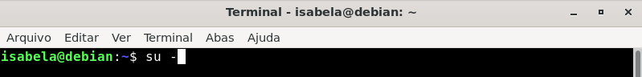


Digite a senha ao ser solicitado:

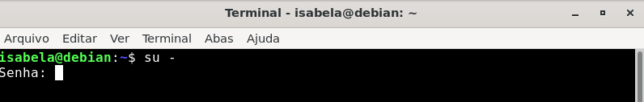


Em seguida, dê o comando: 
```sh
    # apt update
```
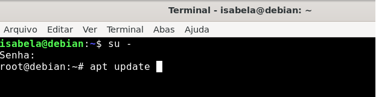


Depois, dê o comando:
```sh
    # apt install inkscape
```
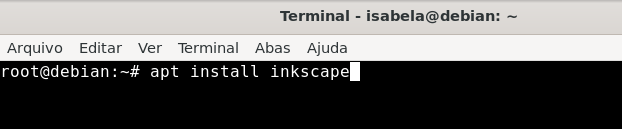


Quando aparecer a pergunta "Você quer continuar? [S/n], responda: 
```sh
    # S
```
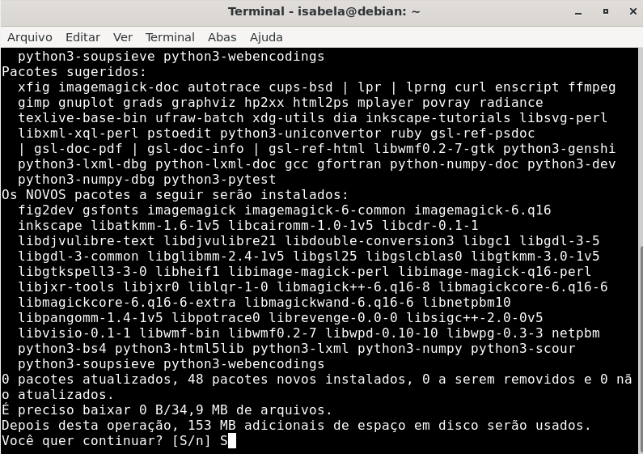


**Por fim, o aplicativo está instalado. Você pode abrir e testar.**

-----


## Instalação usando Gnome Software

Entre no menu, clicando no ícone de pezinho. 

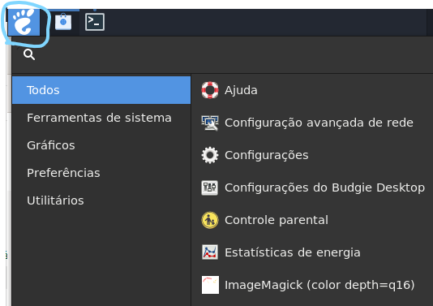


Abra o “programs” ou “programas” na sua máquina 

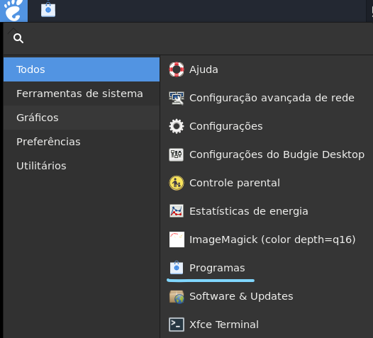


Na lupa, localizada ao lado de “explorar” escreva:  
```sh
    inkscape
```
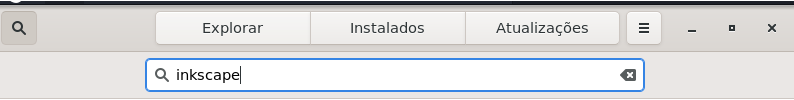


Ele vai aparecer como “inkscape”, com uma logo preta:
```sh
    clique nele 
```
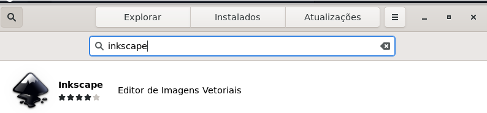

 
Quando clicar, a página do aplicativo vai abrir, com um resumo, as avaliações, os detalhes, e um botão azul escrito “instalar” (localizado logo abaixo da logo):
```sh
    clique em “Instalar” 
```
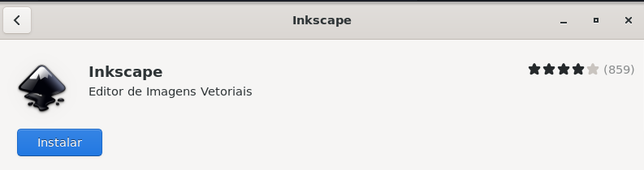


Ele vai solicitar sua senha, e depois de autenticado, inicia a instalação 

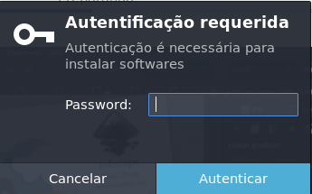


Ao final da instalação, aparecem os botões: 
* executar - serve para abrir o programa (botão azul) 
* remover - serve para desinstalar o programa (botão branco) 
   

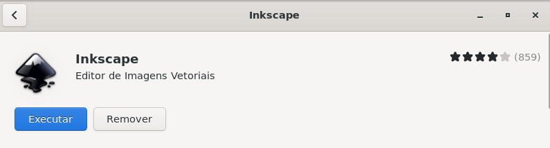

-------

## Utilização básica

Para aqueles que estão utilizando o inkscape pela primeira vez e não sabem por onde começar, aqui estão algumas funcionalidades básicas:

**Iniciando:**
* Ao abrir o inkscape, você encontra uma seta localizada no canto inferior esquerdo (logo abaixo do ícone de spray), nessa seta, existem quatro funcionalidades importantes: borracha, conector (linhas), zoom, e
medidor (uma espécie de régua).

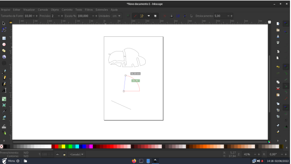


**Desenhando Fórmulas:**
* Na barra de ferramentas ao lado esquerdo, é possível observar alguns ícones, esses
ícones são funcionalidades. O ícone que é um quadrado, por exemplo, serve para
desenhar um quadrado, também tem um círculo, um de blocos, um de estrela e um
de espiral. Com o mouse, é possível ajustar o tamanho das formas.

* Além disso, clicando em “Preenchimento e Contorno”, no canto inferior do lado
esquerdo, é possível ajustar o preenchimento da forma e o seu contorno.

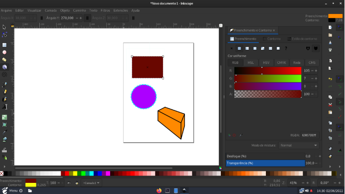
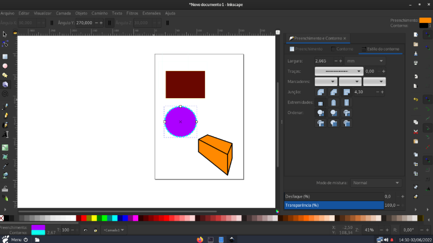


**Outras funcionalidades:**
* Logo abaixo das formas estão os ícones/funcionalidades: caneta para desenho de
curvas e linhas, lápis para desenho livre e caneta ortográfica. Também tem o de
texto. Todos eles podem ser ajustados com preenchimento e contorno, assim como
as formas.

* Além das funcionalidades mencionadas, a mesma barra de ferramentas do lado
esquerdo conta com: gradiente, malha, conta-gotas, lata de tinta, ajustador, e outros, que podem ser explorados pelo usuário.

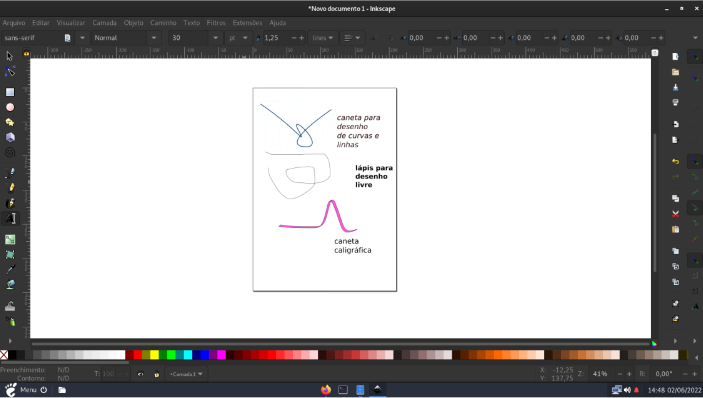

**Vetorização de Imagem**
* **O que é:** vetorizar uma imagem trata-se de uma forma de transformar os pixels dela em curvas, linhas e pontos, com a possibilidade de modificar seus elementos
separadamente. Uma imagem vetorial pode ser ampliada ou reduzida infinitamente,
sem perder a qualidade.

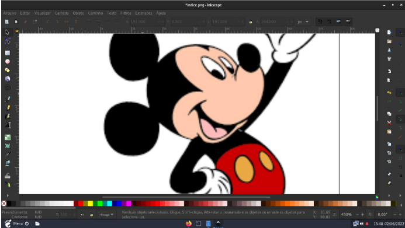


* Aqui está um tutorial simples de vetorização, para iniciantes:
    1. Primeiro, é preciso escolher e selecionar a imagem que deseja vetorizar
    2. Depois, vá na opção “Caminho” e clique em “Traçar Bitmap”
    3. Em seguida, vá em “Varreduras Múltiplas” e troque “Níveis do Brilho” por
    “Cores”, selecione a opção “Pilha” e depois clique em “Aplicar”


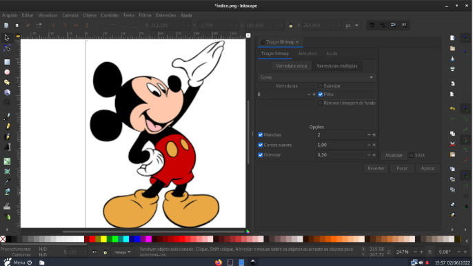

E por fim, você terá uma imagem vetorizada, com maior qualidade.


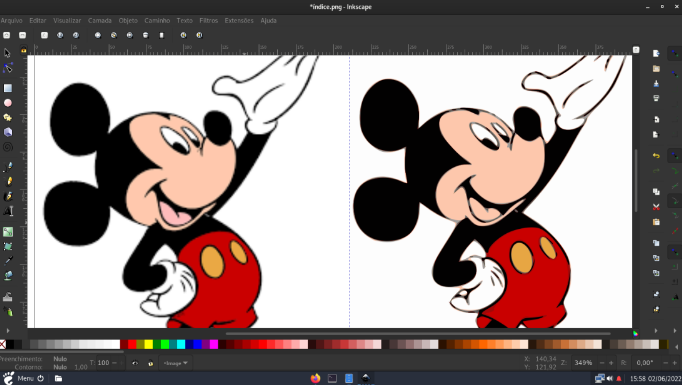


**Esse é um exemplo de utilização básica, para quem não sabe por onde começar, porém, conforme se explora o programa, e através de pesquisas de outras funcionalidades, é possível utilizar ele de maneiras diferentes.**

----
