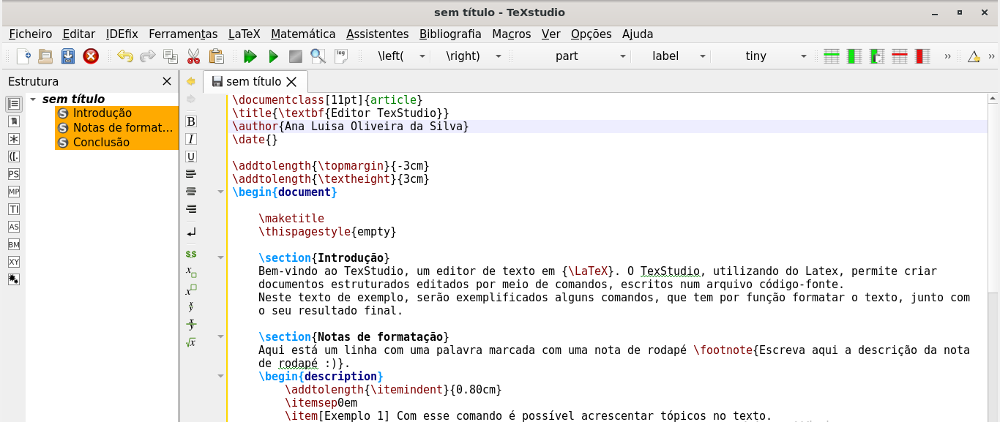
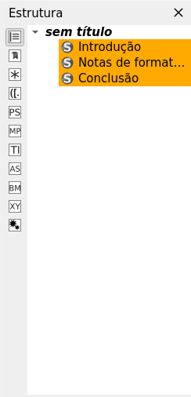
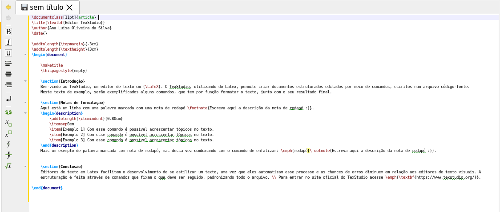

<h1 align=center> Editor de texto TexStudio  </h1>
<div align=center>
 


</div>

<p align=justify> 
O aplicativo TexStudio é um editor de Latex para o sistema Linux, porém ele é um software mais avançado, com mais funções. O TexStudio, utilizando do Latex, permite criar documentos estruturados editados por meio de comandos, escritos num arquivo código-fonte. Esse software tem funções voltadas para a montagem de documentos, como por exemplo permitir criar capas, adicionar índices, notas de rodapé, referências cruzadas, configurar indentações e muito mais: ele é muito útil para se realizar formatações limpas e bem organizadas em documentos textuais.
</p>
<div align=center>
 
 

</div>

## Instalação via linha de comando | 32bits e 64bits

Para instalar é preciso usar um terminal como root (administrador) e executar o seguinte comando:

```sh
apt install texstudio
```

## Utilização básica

<h3> 1. Funções principais e menus</h3>
<p align=justify>
Este software possui uma barra de menus em seu topo que permitem realizar várias ações de uso e edição de arquivos em Latex. Dentre elas, as principais: em “Ficheiro” pode-se criar, abrir e salvar arquivos .tex; em “Editar” pode-se cortar, copiar e colar textos dentro do próprio código-fonte, já se adicionando assim os comandos desejados (neste tópico também se encontra a opção de localizar e substituir palavras); em “Ferramentas” pode-se compilar o código-fonte; em Latex e Matemática pode-se escolher ao clicar em uma das opções, adicionar comandos prontos que realizam uma determinada formatação dentro do texto; e, em “Ajuda”, o usuário pode aprender mais sobre o funcionamento do Latex em si. 
A maioria dessas opções tem atalhos visuais logo abaixo dessa barra de menu (ao deixar o mouse parado sobre cada ícone, é apresentado sua respectiva função).
</p>
<div align=center>
 
 

</div>

<p align=justify>
A maioria dessas opções tem atalhos visuais logo abaixo dessa barra de menu (ao deixar o mouse parado sobre cada ícone, é apresentado sua respectiva função).
</p>
<div align=center>
 
 

</div>

<p align=justify>
 Na divisão da tela maior e principal, temos o espaço para digitar o código-fonte com todos os comandos necessários para o documento desejado. 
</p>
<div align=center>
 
 


</div>

<p align=justify>
Ao lado dela, tem-se uma barra lateral com as estruturas definidas ao longo do código-fonte (como parte, capítulo e seção, por exemplo) para ter-se a elas um acesso mais fácil e dinâmico. 
</p>
<div align=center>
 
 


</div>

<p align=justify>
Abaixo da maior tela temos um espaço destinado a compilação do arquivo: nela são listados os erros no código-fonte que impedem a criação do documento final com êxito, ou então se o processo de compilação saiu normalmente.

</p>
<div align=center>
 
 

</div>

<div align=center>
 
 

</div>

<p align=justify>
O processo de estruturação do documento e os comandos, são praticamente os mesmos para a maioria dos editores de Latex. Sendo assim,  aqui se segue um tutorial de como fazer uma estrutura básica de um texto do tipo artigo, como exemplo, utilizando o Latex no software TexStudio:
</p>


<p align=justify>
O comando \documentclass{article} cria um documento do tipo artigo, ou seja, com as características de um documento do tipo artigo. Os comandos \title{título}, \author{nome do autor} e \date{} permitem definir título, autor e a data de criação do documento, respectivamente, - eles fazem parte do preâmbulo do documento. A partir de \begin {document} tem-se o início do documento, onde podemos o desenvolver, e após desenvolvido fechá-lo com o comando \end {document}. Outros comandos importantes para o documento durante o seu desenvolvimento são o \section {nome da seção} que cria uma seção dentro do documento, o \emph{texto a ser enfatizado} que enfatiza palavras dentro do texto, o \footnote{texto} que adiciona uma nota de rodapé no arquivo, \item[nome do item] cria um tópico dentro do texto e \textbf{texto} coloca o texto desejado em negrito.
</p>
<div align=center>
 
 

</div>

<p align=center>
O resultado final do texto já compilado num arquivo .pdf fica assim:
</p>
<div align=center>
 
 

</div>
