# TOTEM 
Programa de Áudio e Vídeo
#

O Totem é o player de vídeo oficial do ambiente Gnome e é baseado nas bibliotecas do Xine e opcionalmente GStreamer. É capaz de criar listas e arquivos multimídia, reproduzir em tela cheia, realizar buscas, e também possui controles de volume e suporta navegação pelo teclado. 

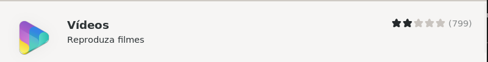


---

## Instalação via linha de comando | 32bits e 64bits | 
Para instalar é preciso usar um terminal como root (administrador), então, abra o terminal e com a VM limpa, entre como root através do comando: 
```sh
    su -
```
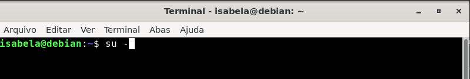

Digite a senha ao ser solicitado: 

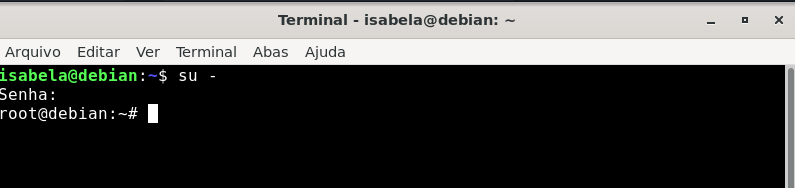

Em seguida, dê o comando: 
```sh
    # apt update
```
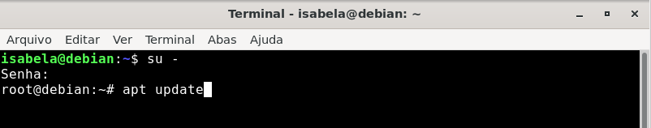

Depois, dê o comando:
```sh
    # apt install totem
```

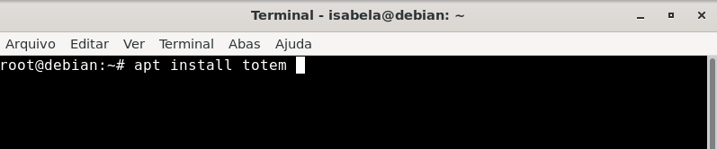

Quando aparecer a pergunta "Você quer continuar? [S/n], responda: 
```sh
    # S
```
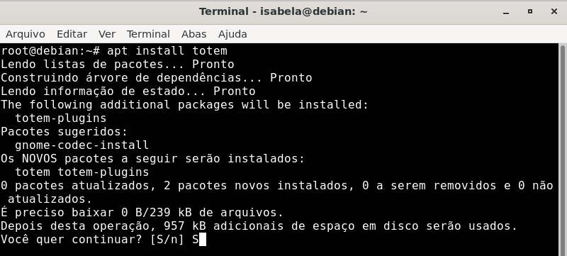

**Por fim, o aplicativo está instalado. Você pode abrir e testar.** 

----

## Instalação usando Gnome Software

Entre no menu, clicando no ícone de pezinho. 

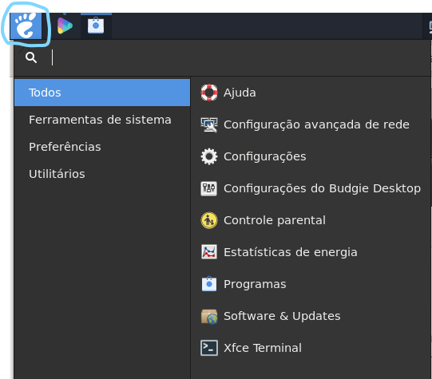

Abra o “programs” ou “programas” na sua máquina 

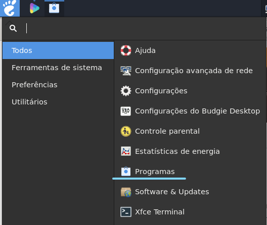

Na lupa, localizada ao lado de “explorar” escreva:  
```sh
    totem
```
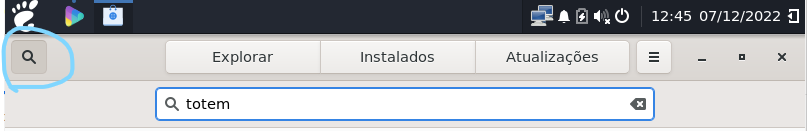

Ele vai aparecer como “vídeos”, com uma logo colorida:
```sh
    clique nele 
```
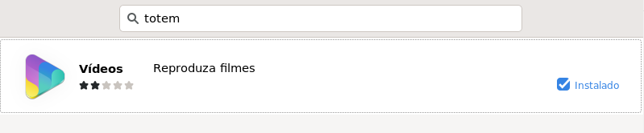

Quando clicar, a página do aplicativo vai abrir com um resumo, as avaliações, os detalhes, e um botão azul escrito “instalar” (localizado logo abaixo da logo):
```sh
    clique em “Instalar” 
```
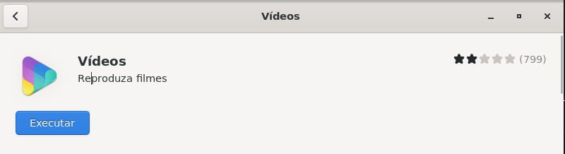

**obs**: no meu caso, o aplicativo já havia sido instalado através do terminal, portanto, aparece o botão executar. mas para você, aparecerá o botão "Instalar"

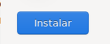

Ele vai solicitar sua senha, e depois de autenticado, inicia a instalação.

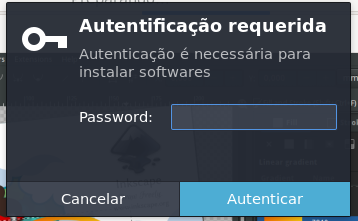

Por fim, o aplicativo está instalado. Você pode abrir e testar. 

Ao final da instalação, aparece o botão: 
* executar - serve para abrir o programa (botão azul) 

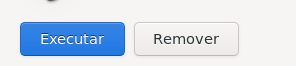


---

## Utilização básica

**Abrindo, reproduzindo e editando/personalizando um arquivo de vídeo, dentro do Totem:**

* Ao abrir o Totem, o vídeo baixado já estará aparecendo na tela principal do software, ou seja, não será necessário abrir o arquivo, apenas dê um clique no vídeo que deseja reproduzir. Assim o seu arquivo de vídeo será reproduzido no Totem.

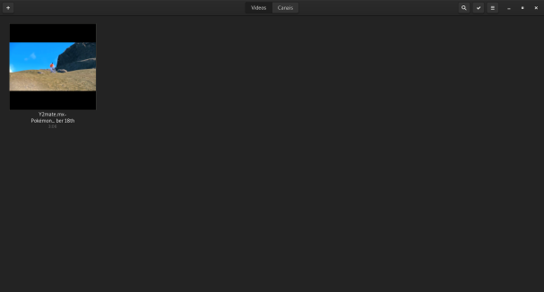

* Ao clicar na aba Arquivo (três pontos na vertical), é possível girar o seu vídeo, capturar a tela em qualquer momento do vídeo, mexer em preferências específicas, etc.
  
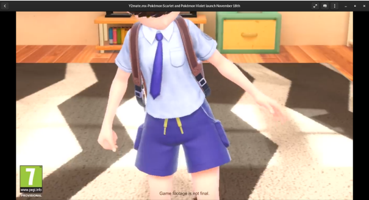

* Na aba de Idiomas e Legendas (balãozinho de conversa), é possível trocar o áudio do
vídeo para os idiomas disponíveis e também é possível adicionar arquivos de legendas,
ou selecionar legendas disponíveis.

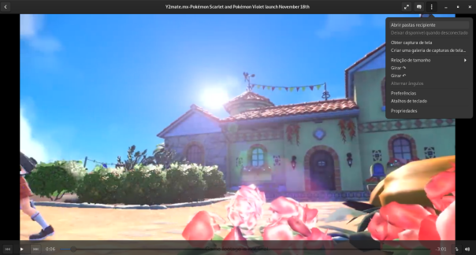

**Esse é um exemplo de utilização básica, para quem não sabe por onde começar, porém, conforme se explora o programa, e através de pesquisas de outras funcionalidades, é possível utilizar ele de maneiras diferentes.**
 


----

